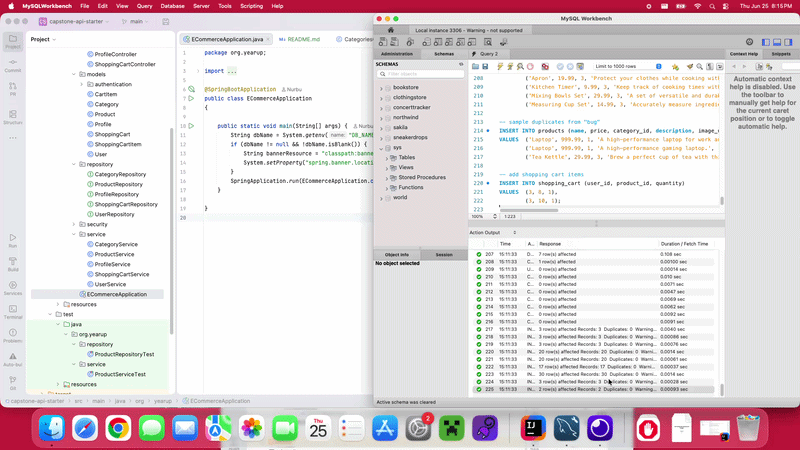
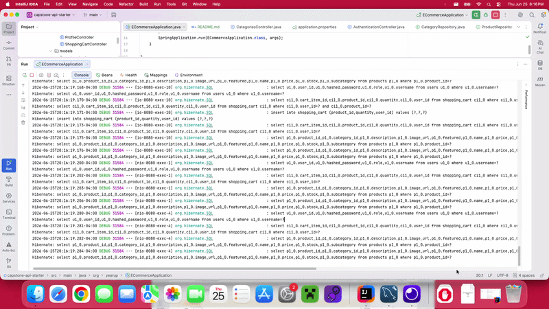
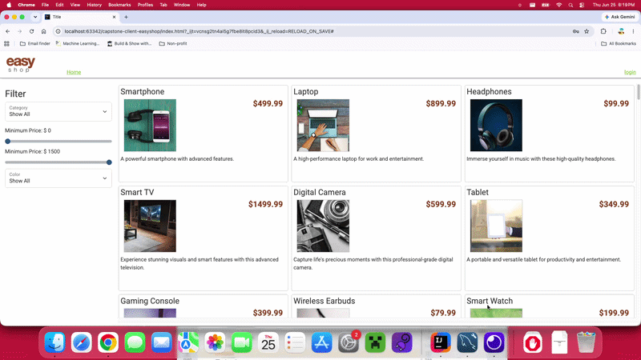

# Concert Tracker

## Description of the Project

A simple online store that's built using spring boot, JPA, and includes a frontend.
Allows users to shop online with their own account. Users are allowed to filter products, login, update their profile,
and add products to cart. Also, for admins they are able to create, update, and delete categories of products
as needed.

## Setup

Instructions on how to set up and run the project using IntelliJ IDEA.

### Prerequisites

- IntelliJ IDEA: Ensure you have IntelliJ IDEA installed, which you can download
  from [here](https://www.jetbrains.com/idea/download/).
- Java SDK: Make sure Java SDK is installed and configured in IntelliJ.

### Running the Application in IntelliJ

Follow these steps to get your application running within IntelliJ IDEA:

1. Open IntelliJ IDEA.
2. Select "Open" and navigate to the directory where you cloned or downloaded the backend of the project.
3. After the project opens, wait for IntelliJ to index the files and set up the project.
4. Find the main class with the `public static void main(String[] args)` method.
5. Open MySQLWorkbench add the run the query script to refresh the database.
6. Right-click on the file and select 'Run 'YourMainClassName.main()'' to start the application.
7. At the top bar hover file then select "Open" and navigate to the directory where you cloned or downloaded the
   frontend of the project.
8. After the project opens, find the chrome icon to open the website.

## Technologies Used

- Java: Mention the version you are using.
- Any additional libraries or frameworks used in the project.

## Demo

- Initial setup and Insomnia tests
-

- Frontend

- Admin login

## Future Work

Outline potential future enhancements or functionalities you might consider adding:

- Complete phase 5
- Try and tinker with the frontend.

## Resources

List resources such as tutorials, articles, or documentation that helped you during the project.

- https://www.geeksforgeeks.org/advance-java/derived-query-methods-in-spring-data-jpa-repositories/
- https://raymaroun.github.io/yearup-java-visuals/week-10/index.html
- https://raymaroun.github.io/yearup-java-visuals/week-11/index.html
- https://github.com/RayMaroun/yearup-spring-section-8-2026/blob/main/pluralsight/java-development/workbook-9/exercise-11-design-the-access-levels/solution.md
  -https://github.com/RayMaroun/yearup-spring-section-8-2026/blob/main/pluralsight/java-development/workbook-9/sneaker-drops-api-6/src/main/java/com/pluralsight/sneakerdrops/service/SneakerService.java

## Team Members

- **Nurbu** - Developer.

## Thanks

Express gratitude towards those who provided help, guidance, or resources:

- Thank you to [Raymond] for continuous support and guidance.
- A special thanks to all teammates for their dedication and teamwork.
 